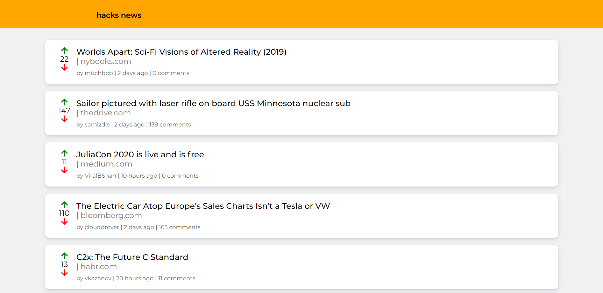
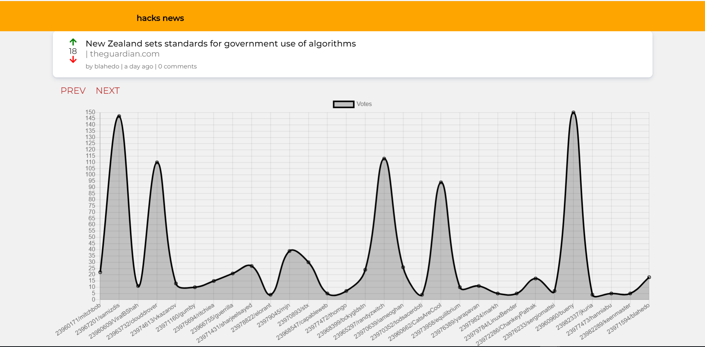

# Hacks News
This is Hacker news site : A Mobile friendly, PWA with graph and voting .
Build in Angular ,
Add nodejs-express  on top of that so that right now host on heroku and in future add api's in nodejs backend .

[Live Demo](http://hacksnews.herokuapp.com/)

## Usage

Clone the repo and run `npm install` to install all the dependencies
Once the dependencies are installed, you can run `ng serve` to start the application.
ng serve will load on localhost:4200

Or 

`ng build `
`npm start`
npm start will load on localhost:8080

## Author

**Shubham Kucheria**

* Linkedin [ShubhamKucheria](https://www.linkedin.com/in/shubham-kucheria-392769a9/)
